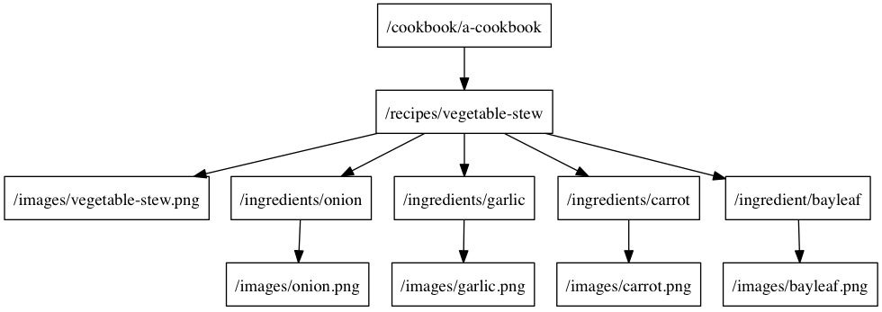

# DRBOperationTree
DRBOperationTree is an iOS and OSX API to organize work (NSOperations) into a tree such that the output of each parent is passed to it's children for further processing.

# Example
Let's say we have an API with the following endpoints:

<table>
  <tr>
    <td>/cookbook/{cookbook_id}</td>
    <td>provides a list of recipe ids</td>
  </tr>
  <tr>
    <td>/recipes/{recipe_id}</td>
    <td>provides JSON representation of recipe</td>
  </tr>
  <tr>
    <td>/ingredients/{ingredient_id}</td>
    <td>provides JSON representation for an ingredient</td>
  </tr>
  <tr>
    <td>/images/{image_id}</td>
    <td>provides PNG image</td>
  </tr>
</table>

In order to serialize the object graph for a cookbook, we'd need to fetch the list of recipe ids from the `/cookbook/{cookbook_id}` endpoint, then fetch each recipe and it's image, followed by each ingredient and it's image. At each step, we need to look at the response of a previous request to know what the next requests will be. For example, to know which (and how many) `/ingredients/{ingredient_id}` requests we'll make, we have to first fetch and parse `/recipes/{recipe_id}/ingredient`. We can think of these dependencies as a tree.

So if we were to serialize the object graph for a vegetable stew recipe, the tree of requests we'd make would be something like this:

Let's say we're making an iOS app which will display all the recipes in a cookbook. For this example, the main view is a list of recipes with an image and an abbreviated list of their ingredients. One approach to fetching the data for our app could be to fetch all of the recipes given by /cookbook/{cookbook_id}, then all of the ingredients for each, then all of the images, and so on. Something like:

<pre>
id cookbook = [self fetchCookbook:cookbookID];
id recipes = [NSMutableArray array];
for (id recipe in cookbook.recipes) {
    id recipe = [self fetchRecipe:recipeID];
    [recipes addObject:recipe];
    for (id image in recipe.images) {
        id imageFile = [self fetchImage:image];
        [recipe.imageFiles addObject:imageFile];
    }
    for (id ingredient in recipe.ingredients) {
        id ingredient = [self fetchIngredient:ingredient];
        for (id image in ingredient.images) {
          id imageFile = [self fetchImage:image];
          [ingredient.imageFiles addObject:imageFile];
        }
    }
}
return recipes;
</pre>

The problem with that approach is that the user is left waiting for all of the recipes to download before we can show them even one in the list. A better user experience would be to make fully serialized recipe objects available to the user as early as possible by fetching each recipe's child objects (and their child objects) in parallel. DRBOperationTree let's us do exactly that. We can use DRBOperationTree to define the dependencies and execute each branch of the tree in parallel. As soon as all the leaves are encountered beneath a node, an object is fully serialized and ready to display. Here's how the code above could be refactored to use DRBOperationTree:

<pre>
DRBOperationTree *cookbook = [DRBOperationTree tree];
DRBOperationTree *recipe = [DRBOperationTree tree];
DRBOperationTree *recipeImage = [DRBOperationTree tree];
DRBOperationTree *ingredient = [DRBOperationTree tree];
DRBOperationTree *ingredientImage = [DRBOperationTree tree];

recipe.provider = [[RecipeProvider alloc] init];
recipeImage.provider = [[RecipeImageProvider alloc] init];
ingredient.provider = [[IngredientProvider alloc] init];
ingredientImage.provider = [[IngredientImageProvider alloc] init];

[cookbook addChild:recipe];
[recipe addChild:recipeImage];
[recipe addChild:ingredient];
[ingredient addChild:ingredientImage];

[cookbook sendObject:@"a-cookbook" completion:^{
  // all done
}];
</pre>

Anytime the recipe node finishes serializing a recipe, it passes that recipe object to it's children, the recipeImage node and the ingredient node. The recipeImage node downloads all images for the recipe while the ingredientNode downloads each ingredient. As soon as the ingredientNode has a serialized ingredient, it will pass that object along to the ingredientImage node, which will download all images for the ingredient. Each node does it's work asynchronously, so that recipes can be serialized in parallel. As soon as a recipe object and it's children are fully serialized, it's ready to send to the view for display.

